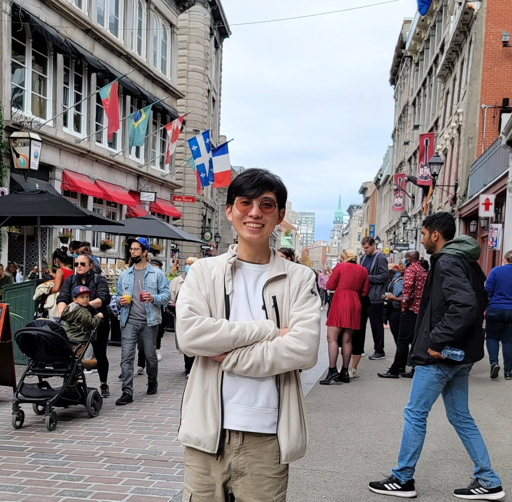

::: {.hero-grid}

::: {.hero-copy}

## Ittisak Promma, Ph.D. Chem. Eng.

I develop computational tools for process systems where transport, reaction, and data-driven models need to work together. My work focuses on turning high-fidelity simulations and experimental observations into practical reduced-order models for bioprocess analysis, optimization, control, and teaching.

::: {.hero-actions}
[Profile](#profile){.btn .btn-primary}
[Education](education.qmd){.btn .btn-secondary}
[Publications](publications.qmd){.btn .btn-secondary}
[Courses](courses.qmd){.btn .btn-secondary}
[Email](mailto:itpromma@outlook.com){.btn .btn-secondary}
:::

:::

::: {.hero-card}
{.profile-photo}

**Research and teaching focus**

Chemical/bioprocess modeling, simulation, control, optimization, and hybrid machine-learning models

:::

:::

## Profile {#profile}

I am a chemical engineer with a Ph.D. from the University of Waterloo. My research connects computational fluid dynamics, reduced-order modeling, metabolic models, and population balance models to study complex bioreactor systems. I am especially interested in models that preserve the important physics of CFD while remaining fast enough for repeated simulation, optimization, control, and operating-condition exploration.

## Research themes

::: {.card-grid}

::: {.info-card}
### CFD-informed reduced-order models

Compartmental modeling workflows that preserve key hydrodynamic behavior from CFD while reducing computational cost.
:::

::: {.info-card}
### Process modeling

Integration of transport models with kinetic models, dynamic flux balance analysis, and population balance models.
:::

::: {.info-card}
### Hybrid modeling and machine learning

Physics-informed learning approaches for model correction, surrogate modeling, and process analysis.
:::

:::

## Courses

I teach and develop materials in process modeling, simulation, thermodynamics, numerical methods, optimization, and computational methods for chemical engineering. Course pages on this site are organized so that additional courses can be added over time.

[View course materials](courses.qmd){.btn .btn-primary}

## Selected expertise

- Process systems engineering
- Computational fluid dynamics and compartmental modeling
- Dynamic flux balance analysis and bioprocess modeling
- Population balance modeling
- Numerical methods for ODEs, algebraic systems, and process simulation
- Process optimization, control, and hybrid machine-learning models

## Contact

**Email:** [itpromma@outlook.com](mailto:itpromma@outlook.com)  
**Location:** Waterloo, Ontario, Canada
